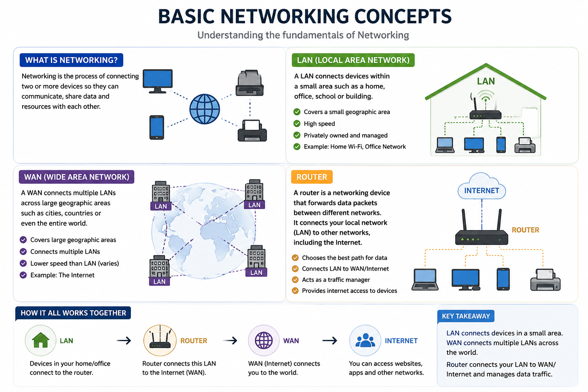

# 🌐 Day 01 - Networking Basics

## 🚀 Learning Journey

Today, I started my networking learning journey and learned some basic concepts that are important for Cybersecurity and Ethical Hacking.

## 📚 Topics Covered

- Computer Network
- LAN (Local Area Network)
- WAN (Wide Area Network)
- Router

## 🔹 What I Learned

### Computer Network

A computer network is a collection of connected devices that communicate and share data with each other.

### LAN (Local Area Network)

LAN connects devices within a small area like a home, school, or office.

### WAN (Wide Area Network)

WAN connects devices over a large geographical area, such as different cities or countries.

### Router

A router connects different networks and forwards data between them. It helps devices communicate and access the internet.

## 🎯 Key Takeaways

- Learned the basics of computer networking.
- Understood how LAN and WAN work.
- Learned the role of a router in communication.
- Built the first foundation for cybersecurity learning.

## 🖼️ Networking Diagram

## 🛡️ Cybersecurity Connection

Networking knowledge is the first step toward becoming a Web Application Penetration Tester and Ethical Hacker.

Understanding how networks communicate helps in learning security concepts.

## 🚀 Next Steps

Continuing my journey by learning more networking concepts and practicing daily.

---

⭐ This repository is part of my Networking and Cybersecurity learning journey.
