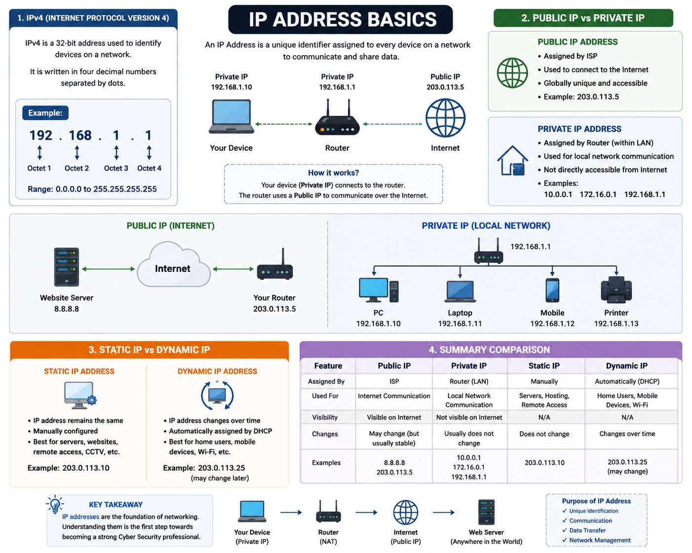

# 🌐 IP Address Basics

## 📖 Overview

This repository contains my notes on **IP Address Basics**, one of the fundamental topics in Networking.

I am currently learning Networking Fundamentals as part of my journey toward becoming a **Web Application Penetration Tester** and **Ethical Hacker**.

The purpose of this repository is to document my learning and build a strong foundation in networking concepts.

---

# 📌 Topics Covered

- IPv4 (Internet Protocol Version 4)
- Public IP Address
- Private IP Address
- Static IP Address
- Dynamic IP Address
- Public vs Private IP
- Static vs Dynamic IP

---

---

# 🔹 IPv4 (Internet Protocol Version 4)

IPv4 is a **32-bit Internet Protocol** used to uniquely identify devices on a network.

Example:

192.168.1.1

### Purpose

- Provides a unique address for every device.
- Enables communication between devices.
- Allows data to travel across networks and the Internet.

---

# 🌍 Public IP Address

A **Public IP Address** is assigned by an **Internet Service Provider (ISP)** and is accessible over the Internet.

### Purpose

- Connects a network to the Internet.
- Allows communication with devices worldwide.
- Used for websites, online applications, and Internet services.

---

# 🏠 Private IP Address

A **Private IP Address** is used inside a Local Area Network (LAN). It is not directly accessible from the Internet.

### Private IP Ranges

- 10.0.0.0 – 10.255.255.255
- 172.16.0.0 – 172.31.255.255
- 192.168.0.0 – 192.168.255.255

### Purpose

- Connects devices inside a local network.
- Enables communication between local devices.
- Improves security by hiding internal devices from the public Internet.

---

# 📌 Static IP Address

A **Static IP Address** is manually assigned and does not change.

### Common Uses

- Web Servers
- Mail Servers
- CCTV Systems
- Remote Access
- Business Networks

### Advantages

- Stable connection
- Easy remote access
- Best for hosting services

### Disadvantages

- Manual configuration required
- Can be more expensive

---

# 🔄 Dynamic IP Address

A **Dynamic IP Address** is automatically assigned by a **DHCP Server** and may change over time.

### Common Uses

- Home Internet
- Mobile Devices
- Office Networks
- Wi-Fi Users

### Advantages

- Automatic configuration
- Easy management
- Cost-effective

### Disadvantages

- IP address can change
- Less suitable for hosting servers

---

# 📊 Comparison

## Public IP vs Private IP

| Public IP | Private IP |
|------------|------------|
| Used on the Internet | Used inside a Local Network |
| Assigned by ISP | Assigned by Router |
| Globally Accessible | Local Access Only |

---

## Static IP vs Dynamic IP

| Static IP | Dynamic IP |
|------------|------------|
| Does not change | Changes automatically |
| Manually assigned | Automatically assigned |
| Best for servers | Best for home users |

---

# 🎯 Key Takeaways

- Learned what IPv4 is and how it works.
- Understood the difference between Public and Private IP addresses.
- Learned the difference between Static and Dynamic IP addresses.
- Improved my understanding of network communication.

# 🖼️ Network Diagram

---

# 🚀 Learning Journey

I am currently learning Networking Fundamentals and documenting everything I learn on GitHub.

This repository is part of my roadmap toward becoming a **Web Application Penetration Tester** and **Ethical Hacker**.

More networking notes and cybersecurity topics will be added soon.

---

## ⭐ If you found this repository helpful, consider giving it a Star!

## 🌐 Connect With Me
🔗 LinkedIn: [My LinkedIn Profile](https://www.linkedin.com/in/talhanoor-cybersecurity/)
