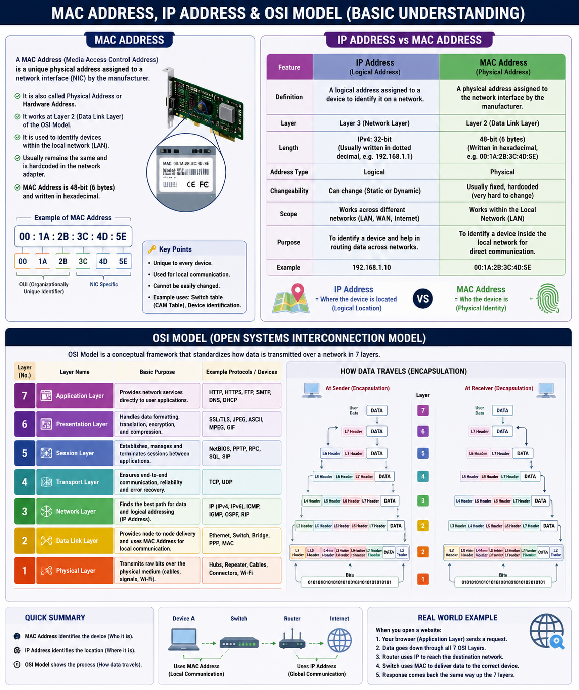

# 🌐 Building My Networking Foundation – MAC Address, IP Address & OSI Model

> **Day's Learning:** Strengthening my Networking Fundamentals on my journey to becoming a Cybersecurity & Web Application Penetration Testing Professional.

---

## 📖 Introduction

Today, I continued building my networking fundamentals.

Rather than jumping directly into advanced cybersecurity topics, I am focusing on mastering the basics because every expert starts with a strong foundation.

Networking is one of the most important skills for anyone pursuing Cybersecurity, Ethical Hacking, or Web Application Penetration Testing.

---

# 📚 What I Learned Today

## 🔹 MAC Address

A **MAC (Media Access Control) Address** is a unique physical address assigned to a network interface by the manufacturer.

### Key Points

- Every network device has its own unique MAC Address.
- It is a **physical (hardware) address**.
- It is primarily used for communication within a **Local Area Network (LAN)**.
- It usually remains the same throughout the life of the network interface.

---

## 🔹 IP Address vs MAC Address

Today, I learned the fundamental difference between an IP Address and a MAC Address.

### 🌍 IP Address

- Logical address
- Can change depending on the network
- Used to identify devices across different networks
- Helps data travel from one network to another

---

### 💻 MAC Address

- Physical hardware address
- Assigned by the manufacturer
- Usually does not change
- Used to identify devices inside the same local network

---

## 📝 Simple Way to Remember

| IP Address | MAC Address |
|------------|-------------|
| **Where the device is located** | **Who the device is** |

---

# 🌐 OSI Model

The **OSI (Open Systems Interconnection) Model** explains how data travels from one device to another through **seven layers**.

Learning the OSI Model helps understand how networks function and how communication happens between devices.

---

# 📌 The 7 Layers of the OSI Model

| Layer | Name | Purpose |
|------|------------------|-----------------------------------------------|
| 7 | Application | Provides network services to applications used by users |
| 6 | Presentation | Handles data formatting, encryption, and compression |
| 5 | Session | Starts, manages, and ends communication sessions |
| 4 | Transport | Ensures reliable and complete data delivery |
| 3 | Network | Uses IP Addresses to route data between networks |
| 2 | Data Link | Uses MAC Addresses for communication within a LAN |
| 1 | Physical | Transfers bits using cables, Wi-Fi, and electrical/radio signals |

---

# 💡 My Biggest Takeaway

Today I learned that networking is much more than simply connecting devices.

Every piece of data follows a structured communication process:

- Devices are identified using **MAC Addresses**.
- Networks communicate using **IP Addresses**.
- The **OSI Model** explains every step involved in data communication from start to finish.

Understanding these concepts will make learning networking, ethical hacking, and penetration testing much easier in the future.

---

# 🚀 Learning Progress

✅ MAC Address

✅ IP Address

✅ Difference Between IP Address & MAC Address

✅ OSI Model

✅ Seven Layers of the OSI Model


## 🖼️MAC-IP-OSI Diagram



---

# 🎯 Goal

I believe that **strong fundamentals create strong professionals**.

My goal is to master networking concepts one step at a time before moving into advanced Cybersecurity and Web Application Penetration Testing topics.

---

## 📅 Learning Log

**Topic:** MAC Address, IP Address & OSI Model

**Category:** Networking Fundamentals

**Level:** Beginner

---

## 📌 Connect With Me

I am documenting my learning journey publicly as I work toward becoming a Cybersecurity and Web Application Penetration Testing Professional.

Every day, I aim to learn something new and strengthen my fundamentals.

---

⭐ *Thanks for reading!*

If you found this learning log helpful, feel free to ⭐ star the repository and follow my journey.
```

