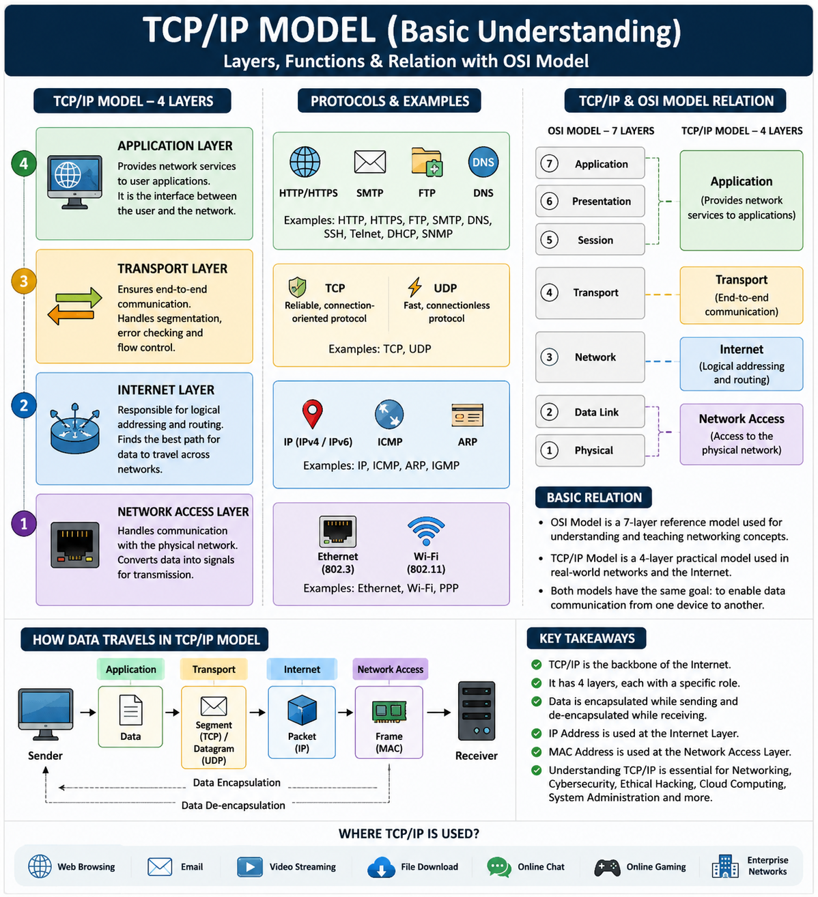

# 🌐 Building My Networking Foundation – TCP/IP Model (Basic Understanding)

> **Day's Learning:** Strengthening my Networking Fundamentals on my journey to becoming a **Cybersecurity Professional** and **Web Application Penetration Tester**.

---

# 📖 Introduction

Today, I learned the **TCP/IP (Transmission Control Protocol / Internet Protocol) Model**, which is the foundation of modern computer networking.

Every time we browse a website, send a message, watch a video, or download a file, the **TCP/IP Model** works behind the scenes to make communication between devices possible.

Rather than rushing into advanced cybersecurity topics, I am focusing on building a strong networking foundation because understanding networking is essential for **Cybersecurity**, **Ethical Hacking**, and **Web Application Penetration Testing**.

---

# 📚 What I Learned Today

## 🔹 What is the TCP/IP Model?

The **TCP/IP Model** is a networking model that defines how data is transmitted from one device to another over a network or the Internet.

It divides the communication process into different layers, where each layer has a specific responsibility.

Unlike the **OSI Model**, which is primarily used as a reference model for learning networking concepts, the **TCP/IP Model** is the practical model used in real-world networks and across the Internet.

---

# 🏗️ TCP/IP Model Layers

## 1️⃣ Application Layer

### Responsibilities

- Provides network services to user applications.
- Acts as the interface between the user and the network.
- Enables communication between software applications over a network.

### Common Protocols

- HTTP
- HTTPS
- FTP
- SMTP
- DNS
- SSH

### Purpose

> Allow applications to communicate over the network.

---

## 2️⃣ Transport Layer

### Responsibilities

- Ensures end-to-end communication between devices.
- Breaks data into smaller segments.
- Performs error checking and data recovery.
- Controls data flow.

### Common Protocols

- TCP *(Reliable communication)*
- UDP *(Fast communication)*

### Purpose

> Deliver data accurately and efficiently.

---

## 3️⃣ Internet Layer

### Responsibilities

- Responsible for logical addressing and routing.
- Uses IP addresses to identify devices.
- Finds the best path for data to travel across networks.

### Common Protocols

- IPv4
- IPv6
- ICMP
- ARP

### Purpose

> Move packets from the source to the destination.

---

## 4️⃣ Network Access Layer

### Responsibilities

- Handles communication with the physical network.
- Converts data into signals for transmission.
- Works with MAC addresses and network hardware.

### Examples

- Ethernet
- Wi-Fi

### Purpose

> Send and receive data through the physical network.

---

# 🔄 TCP/IP vs OSI Model

Although both models explain how network communication works, they serve different purposes.

| OSI Model | TCP/IP Model |
|-----------|--------------|
| 7 Layers | 4 Layers |
| Reference Model | Practical Model |
| Used for learning and standardization | Used in real-world networking |
| More detailed | Simpler and implementation-focused |

---

## 🔗 Layer Mapping

| OSI Model | TCP/IP Model |
|-----------|--------------|
| Application + Presentation + Session | Application Layer |
| Transport | Transport Layer |
| Network | Internet Layer |
| Data Link + Physical | Network Access Layer |

---

# 🎯 Key Takeaways

- ✅ TCP/IP is the backbone of the Internet.
- ✅ It consists of **four layers**, each performing a specific task.
- ✅ Every layer communicates with the layer above and below it.
- ✅ TCP/IP is the model used in **real-world networking**, while the **OSI Model** is mainly used for learning networking concepts.
- ✅ Understanding TCP/IP is essential for:
  - Networking
  - Cybersecurity
  - Ethical Hacking
  - Web Application Penetration Testing
  - Cloud Computing
  - System Administration

## 🖼️TCP-IP-Model-Diagram

---

# 💡 Final Thoughts

Every day, I am strengthening my networking fundamentals because a strong foundation is the first step toward becoming a skilled **Cybersecurity Professional** and **Web Application Penetration Tester**.

The more I understand networking, the easier it will be to learn advanced topics such as **Network Security**, **Web Security**, **Penetration Testing**, and **Red Teaming**.

> 🚀 **Learning never stops. Every small step today builds tomorrow's expertise.**

## 📌 Connect With Me

🔗 LinkedIn: [My LinkedIn Profile](https://www.linkedin.com/in/talhanoor-cybersecurity/)

---

# 🏷️ Tags

#TCPIP #Networking #ComputerNetworks #OSIModel #CyberSecurity #EthicalHacking #WebApplicationSecurity #PenetrationTesting #NetworkSecurity #LearningJourney #GitHubLearning
